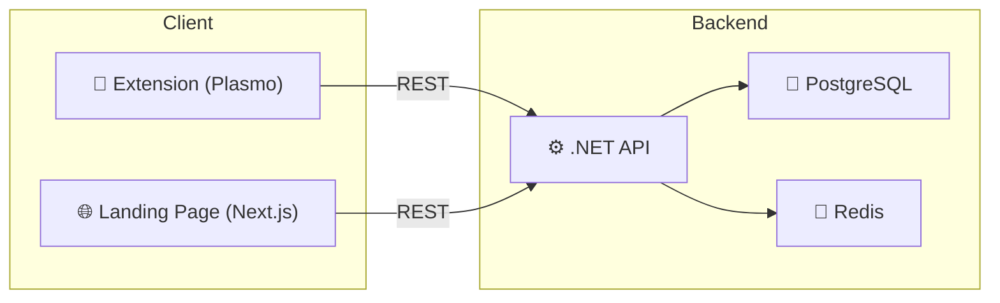
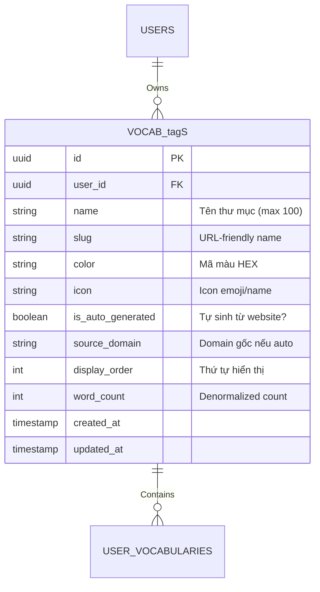
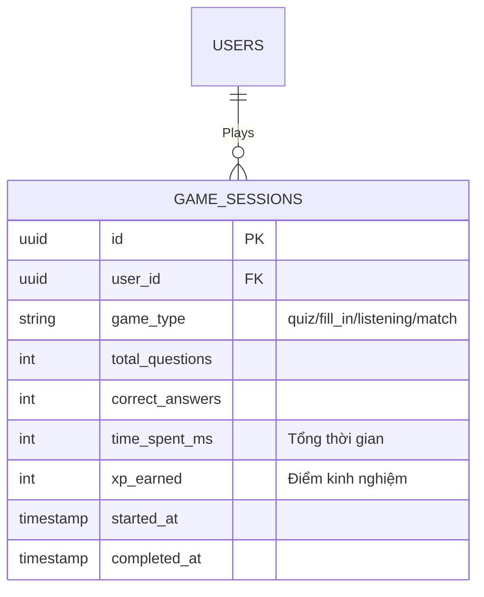

# 🎯 Kế Hoạch Cải Thiện Hệ Sinh Thái LexiVocab — 3 Tính Năng Mới

Dự án hiện tại gồm 3 thành phần: **API** (.NET Clean Architecture, MediatR, PostgreSQL, Redis), **Extension** (Plasmo/React), và **Landing Page** (Next.js). Tài liệu này trình bày kế hoạch chi tiết để bổ sung 3 tính năng mới:

1. **Thư mục từ vựng** — Phân loại từ theo chuyên mục + tự động nhóm theo website
2. **Mini Games ôn tập** — Trắc nghiệm, điền từ, nghe từ, nối nghĩa
3. **Nhắc nhở ngắt quãng** — Thông báo hàng ngày theo thuật toán SM-2

## User Review Required

> [!IMPORTANT]
> **Thay đổi Database Schema**: Cần thêm 2 bảng mới (`VocabTags`, `GameSessions`) và thêm cột `tagId` vào `UserVocabularies`. Đây là breaking change nếu không migration đúng cách.

> [!WARNING]
> **Hangfire**: Hiện tại API chưa có Hangfire. Cần cài đặt package `Hangfire.PostgreSql` và config dashboard. Bạn có muốn dùng Hangfire hay thay bằng `IHostedService` đơn giản hơn?

> [!IMPORTANT]
> **Push Notification**: Extension Chrome hỗ trợ `chrome.notifications` API nhưng chỉ khi extension đang chạy. Email notification cần SMTP service (SendGrid/Mailgun). Bạn muốn ưu tiên kênh nào?

---

## 📊 Tổng Quan Kiến Trúc Hiện Tại



### Các Entity Hiện Có

| Entity | Mô tả | Trạng thái |
|--------|--------|------------|
| [User](file:///e:/lexivocab-ex/LexiVocabAPI/src/LexiVocab.Domain/Entities/User.cs#10-42) | Người dùng, OAuth, Role, JWT | ✅ Hoàn thiện |
| [UserVocabulary](file:///e:/lexivocab-ex/LexiVocabAPI/src/LexiVocab.Domain/Entities/UserVocabulary.cs#11-55) | Flashcard cá nhân + SM-2 fields | ✅ Hoàn thiện |
| [MasterVocabulary](file:///e:/lexivocab-ex/LexiVocabAPI/src/LexiVocab.Domain/Entities/MasterVocabulary.cs#10-33) | Từ điển gốc (5000 từ Oxford) | ✅ Hoàn thiện |
| [ReviewLog](file:///e:/lexivocab-ex/LexiVocabAPI/src/LexiVocab.Domain/Entities/ReviewLog.cs#12-32) | Nhật ký ôn tập (Analytics) | ✅ Hoàn thiện |
| `UserSetting` | Cấu hình Extension | ✅ Hoàn thiện |
| `Subscription` | Gói cước Premium | ✅ Hoàn thiện |

### Các Controller Hiện Có

| Controller | Endpoints | Trạng thái |
|------------|-----------|------------|
| [VocabulariesController](file:///e:/lexivocab-ex/LexiVocabAPI/src/LexiVocab.API/Controllers/VocabulariesController.cs#19-20) | CRUD, Batch Import, Stats, Export | ✅ |
| [ReviewsController](file:///e:/lexivocab-ex/LexiVocabAPI/src/LexiVocab.API/Controllers/ReviewsController.cs#19-20) | GetSession, SubmitReview, History | ✅ |
| [AnalyticsController](file:///e:/lexivocab-ex/LexiVocabAPI/src/LexiVocab.API/Controllers/AnalyticsController.cs#18-19) | Dashboard, Heatmap, Streak | ✅ |
| `AuthController` | Login, Register, Google OAuth | ✅ |
| `PaymentsController` | Checkout, Webhook | ✅ |

---

## 📁 PHẦN 1: THƯ MỤC TỪ VỰNG (Vocab tags)

### 1.1 Mục Tiêu

- Người dùng tự tạo thư mục ("IELTS Writing", "Medical", "Daily Life") để phân loại từ
- Hệ thống **tự động nhóm** từ theo domain của trang web đã tra (các từ từ cùng URL → cùng nhóm)
- Hỗ trợ lọc từ theo thư mục trong danh sách và khi ôn tập

### 1.2 Database Schema Mới



### 1.3 Proposed Changes

---

#### Backend API — Domain Layer

#### [NEW] [Vocabtag.cs](file:///e:/lexivocab-ex/LexiVocabAPI/src/LexiVocab.Domain/Entities/Vocabtag.cs)

Entity mới cho thư mục từ vựng:
- [Id](file:///e:/lexivocab-ex/LexiVocabAPI/src/LexiVocab.API/Controllers/VocabulariesController.cs#36-45), `UserId`, `Name`, `Slug`, `Color`, `Icon`
- `IsAutoGenerated` — đánh dấu tag tự sinh từ website
- `SourceDomain` — lưu domain gốc (vd: "bbc.com")
- `DisplayOrder`, `WordCount` (denormalized)
- Navigation: [User](file:///e:/lexivocab-ex/LexiVocabAPI/src/LexiVocab.Domain/Entities/User.cs#10-42), `UserVocabularies`

#### [MODIFY] [UserVocabulary.cs](file:///e:/lexivocab-ex/LexiVocabAPI/src/LexiVocab.Domain/Entities/UserVocabulary.cs)

Thêm nullable FK `tagId` trỏ tới `Vocabtag`:
```diff
+ public Guid? tagId { get; set; }
+ public Vocabtag? tag { get; set; }
```

#### [NEW] [IVocabtagRepository.cs](file:///e:/lexivocab-ex/LexiVocabAPI/src/LexiVocab.Domain/Interfaces/IVocabtagRepository.cs)

Interface: `GetByUserIdAsync`, `GetBySlugAsync`, `GetOrCreateByDomainAsync`

---

#### Backend API — Application Layer

#### [NEW] DTOs/tag/tagDto.cs, CreatetagRequest.cs, UpdatetagRequest.cs

#### [NEW] Features/tags/Commands/

- `CreatetagCommand` — tạo tag thủ công
- `UpdatetagCommand` — đổi tên, màu, icon
- `DeletetagCommand` — xóa tag (từ bên trong chuyển về "Uncategorized")
- `AssignVocabTotagCommand` — gán từ vào tag
- `AutoAssigntagCommand` — logic tự gán tag dựa trên `SourceUrl`

#### [NEW] Features/tags/Queries/

- `GettagListQuery` — danh sách tag + word count
- `GettagVocabulariesQuery` — lấy từ trong 1 tag (paginated)

#### [MODIFY] Features/Vocabularies/Commands/CreateVocabularyCommand

Khi tạo từ mới, nếu có `SourceUrl` → tự động `GetOrCreateByDomainAsync` để gán tag:
```
1. Parse domain từ SourceUrl (vd: "https://bbc.com/news/..." → "bbc.com")
2. Tìm tag có SourceDomain = "bbc.com" của user
3. Nếu chưa có → tạo auto tag mới (IsAutoGenerated = true)
4. Gán tagId cho UserVocabulary mới
```

---

#### Backend API — Infrastructure Layer

#### [NEW] [VocabtagRepository.cs](file:///e:/lexivocab-ex/LexiVocabAPI/src/LexiVocab.Infrastructure/Repositories/VocabtagRepository.cs)

#### [MODIFY] [AppDbContext.cs](file:///e:/lexivocab-ex/LexiVocabAPI/src/LexiVocab.Infrastructure/Persistence/AppDbContext.cs)

Thêm `DbSet<Vocabtag>` và configure quan hệ 1-N với [UserVocabulary](file:///e:/lexivocab-ex/LexiVocabAPI/src/LexiVocab.Domain/Entities/UserVocabulary.cs#11-55)

#### [NEW] Migration: `AddVocabtags`

---

#### Backend API — Controller

#### [NEW] [tagsController.cs](file:///e:/lexivocab-ex/LexiVocabAPI/src/LexiVocab.API/Controllers/tagsController.cs)

| Method | Route | Mô tả |
|--------|-------|-------|
| GET | `/api/v1/tags` | Danh sách tag + word count |
| GET | `/api/v1/tags/{id}/vocabularies` | Từ trong tag (paginated) |
| POST | `/api/v1/tags` | Tạo tag mới |
| PUT | `/api/v1/tags/{id}` | Cập nhật tag |
| DELETE | `/api/v1/tags/{id}` | Xóa tag |
| PATCH | `/api/v1/tags/{id}/assign` | Gán từ vào tag |

---

#### Extension (Plasmo)

#### [NEW] `src/components/features/tags/`

- `tagList.tsx` — sidebar danh sách tag với badge đếm từ
- `tagSelector.tsx` — dropdown chọn tag khi lưu từ mới
- `CreatetagDialog.tsx` — dialog tạo tag mới
- `tagBadge.tsx` — hiển thị nhãn tag trên mỗi word card

#### [MODIFY] [src/components/features/word-list/words-tab.tsx](file:///e:/lexivocab-ex/lexivocab/src/components/features/word-list/words-tab.tsx)

Thêm filter theo tag vào thanh tìm kiếm

#### [MODIFY] `src/components/features/vocab-saving/`

Khi lưu từ → tự động detect tag từ URL hiện tại

---

#### Landing Page (Next.js)

#### [NEW] `app/[locale]/(dashboard)/dashboard/tags/page.tsx`

Trang quản lý tag với grid view, kéo thả sắp xếp

#### [MODIFY] [components/dashboard/vocabulary-table.tsx](file:///e:/lexivocab-ex/lexivocab-landing/components/dashboard/vocabulary-table.tsx)

Thêm cột "tag" và filter dropdown

---

## 🎮 PHẦN 2: MINI GAMES ÔN TẬP

### 2.1 Mục Tiêu

4 loại game nhỏ giúp ôn tập hàng ngày, sử dụng lại dữ liệu [UserVocabulary](file:///e:/lexivocab-ex/LexiVocabAPI/src/LexiVocab.Domain/Entities/UserVocabulary.cs#11-55) và SM-2:

| Game | Mô tả | Input | Output |
|------|-------|-------|--------|
| 🎯 **Quiz** (Trắc nghiệm) | Hiện từ EN → chọn 1/4 nghĩa VN | Tap 1 đáp án | QualityScore 0-5 |
| ✍️ **Fill-in** (Điền từ) | Hiện câu context bỏ trống → gõ từ | Type word | QualityScore 0-5 |
| 🔊 **Listening** (Nghe từ) | Phát audio → gõ từ nghe được | Type word | QualityScore 0-5 |
| 🔗 **Match** (Nối nghĩa) | 6 từ EN + 6 nghĩa VN → kéo nối | Drag pairs | QualityScore per word |

### 2.2 Database Schema



### 2.3 Proposed Changes

---

#### Backend API — Domain Layer

#### [NEW] [GameSession.cs](file:///e:/lexivocab-ex/LexiVocabAPI/src/LexiVocab.Domain/Entities/GameSession.cs)

#### [NEW] [GameType.cs](file:///e:/lexivocab-ex/LexiVocabAPI/src/LexiVocab.Domain/Enums/GameType.cs)

Enum: `Quiz`, `FillIn`, `Listening`, `Match`

---

#### Backend API — Application Layer

#### [NEW] Features/Games/Queries/

- `GenerateQuizQuery` — lấy N từ due + sinh 3 distractor cho mỗi từ
  - Logic sinh distractor: random từ cùng user HOẶC từ MasterVocabulary có `PopularityRank` gần nhau
- `GenerateFillInQuery` — lấy N từ có `ContextSentence` → mask `WordText` trong câu
- `GenerateListeningQuery` — lấy N từ có `MasterVocabulary.AudioUrl` != null
- `GenerateMatchQuery` — lấy 6 từ due → trả pairs `[WordText, CustomMeaning]`

#### [NEW] Features/Games/Commands/

- `SubmitGameResultCommand` — nhận game result, lưu `GameSession`, và **trigger SM-2 recalculation** cho từng từ trong game
  - Mapping: Correct → `QualityScore.Good (4)`, Wrong → `QualityScore.CompleteBlackout (0)`
  - Tái sử dụng `SrsAlgorithmService.Calculate()` đã có

#### [NEW] Features/Games/Queries/

- `GetGameStatsQuery` — thống kê game: tổng game, accuracy, XP

---

#### Backend API — Controller

#### [NEW] [GamesController.cs](file:///e:/lexivocab-ex/LexiVocabAPI/src/LexiVocab.API/Controllers/GamesController.cs)

| Method | Route | Mô tả |
|--------|-------|-------|
| GET | `/api/v1/games/quiz?count=10` | Sinh bộ câu hỏi Quiz |
| GET | `/api/v1/games/fill-in?count=10` | Sinh bộ Fill-in |
| GET | `/api/v1/games/listening?count=10` | Sinh bộ Listening |
| GET | `/api/v1/games/match` | Sinh 6 pairs Match |
| POST | `/api/v1/games/submit` | Submit kết quả game |
| GET | `/api/v1/games/stats` | Thống kê game |

---

#### Extension (Plasmo)

#### [NEW] `src/components/features/games/`

- `GameHub.tsx` — trang chủ game, chọn loại game, hiện thống kê
- `QuizGame.tsx` — giao diện 4 lựa chọn, animation đúng/sai, progress bar
- `FillInGame.tsx` — hiện câu context bỏ trống, input gõ từ, hint
- `ListeningGame.tsx` — nút play audio, input gõ từ
- `MatchGame.tsx` — kéo thả nối cặp từ-nghĩa
- `GameResult.tsx` — màn hình kết quả: điểm, XP, streak

#### [MODIFY] [src/sidepanel.tsx](file:///e:/lexivocab-ex/lexivocab/src/sidepanel.tsx) hoặc [src/popup.tsx](file:///e:/lexivocab-ex/lexivocab/src/popup.tsx)

Thêm tab "Games" / nút vào menu chính

---

#### Landing Page (Next.js)

#### [NEW] `app/[locale]/(dashboard)/dashboard/games/page.tsx`

Trang game hub với cards cho mỗi loại game, best scores, daily challenge

#### [NEW] `components/dashboard/games/`

- `QuizGameComponent.tsx` — phiên bản full-screen cho web
- `FillInGameComponent.tsx`
- `ListeningGameComponent.tsx`
- `MatchGameComponent.tsx`
- `GameStatsCard.tsx` — widget thống kê trên dashboard

---

## 🔔 PHẦN 3: NHẮC NHỞ NGẮT QUÃNG (Spaced Repetition Reminders)

### 3.1 Mục Tiêu

- Nhắc nhở người dùng ôn tập hàng ngày dựa trên **số thẻ đến hạn** (`NextReviewDate <= now`)
- Kênh thông báo: **Chrome Notification** (Extension) + **Email** (tùy chọn)
- Thời gian nhắc: theo cấu hình user (mặc định 20:00)
- Tần suất: theo **quy tắc ngắt quãng** — nếu user bỏ ôn nhiều ngày → tăng tần suất nhắc

### 3.2 Proposed Changes

---

#### Backend API — Domain Layer

#### [MODIFY] [UserSetting.cs](file:///e:/lexivocab-ex/LexiVocabAPI/src/LexiVocab.Domain/Entities/UserSetting.cs)

Thêm các trường cấu hình notification:
```diff
+ public bool ReminderEnabled { get; set; } = true;
+ public TimeOnly PreferredReminderTime { get; set; } = new(20, 0); // 8 PM
+ public string? TimeZone { get; set; } = "Asia/Ho_Chi_Minh";
+ public bool EmailReminderEnabled { get; set; } = false;
+ public int ConsecutiveMissedDays { get; set; } = 0;
```

---

#### Backend API — Application Layer

#### [NEW] Services/ReminderService.cs

Logic quy tắc ngắt quãng nhắc nhở:
```
- 0 ngày bỏ ôn → nhắc 1 lần lúc PreferredReminderTime
- 1-2 ngày bỏ ôn → nhắc 2 lần (sáng + tối)
- 3+ ngày bỏ ôn → nhắc 3 lần + gửi email tổng hợp
- 7+ ngày → "Bạn đã lâu không ôn tập!" + hiện last streak info
```

#### [NEW] Services/EmailNotificationService.cs

Gửi email reminder qua SMTP (tương thích SendGrid/Mailgun)

---

#### Backend API — Infrastructure Layer

#### [NEW] BackgroundJobs/DailyReminderJob.cs

**`IHostedService`** hoặc **Hangfire RecurringJob** chạy mỗi giờ:
1. Query users WHERE `ReminderEnabled = true` AND có thẻ due
2. Kiểm tra `PreferredReminderTime` + `TimeZone` của user
3. Nếu đã đến giờ → tạo notification record
4. Gửi email nếu `EmailReminderEnabled = true`
5. Cập nhật `ConsecutiveMissedDays`

#### [NEW] BackgroundJobs/StreakCheckJob.cs

Chạy lúc 00:00 UTC hàng ngày:
1. Tìm users không review trong 24h qua
2. Increment `ConsecutiveMissedDays`
3. Reset streak nếu > 48h gap

---

#### Backend API — Controller

#### [MODIFY] [SettingsController.cs](file:///e:/lexivocab-ex/LexiVocabAPI/src/LexiVocab.API/Controllers/SettingsController.cs)

Thêm endpoints quản lý notification settings:

| Method | Route | Mô tả |
|--------|-------|-------|
| GET | `/api/v1/settings/reminders` | Lấy cấu hình nhắc nhở |
| PUT | `/api/v1/settings/reminders` | Cập nhật cấu hình |
| GET | `/api/v1/settings/reminders/status` | Số thẻ due + missed days |

---

#### Extension (Plasmo)

#### [MODIFY] [src/background/index.ts](file:///e:/lexivocab-ex/lexivocab/src/background/index.ts)

Thêm chrome alarm cho reminder:
```typescript
// Kiểm tra thẻ due mỗi giờ
chrome.alarms.create("daily_reminder", { periodInMinutes: 60 });

// Trong alarm listener:
if (alarm.name === "daily_reminder") {
    const dueCount = await api.getDueCardCount();
    if (dueCount > 0) {
        chrome.notifications.create("review_reminder", {
            type: "basic",
            iconUrl: "icon.png",
            title: "⏰ Đến giờ ôn tập!",
            message: `Bạn có ${dueCount} thẻ cần ôn hôm nay`,
            buttons: [{ title: "Ôn tập ngay" }]
        });
    }
}
```

#### [NEW] `src/components/features/settings/reminder-settings.tsx`

UI cấu hình: bật/tắt, chọn giờ, bật email reminder

---

#### Landing Page (Next.js)

#### [MODIFY] [components/dashboard/dashboard-nav.tsx](file:///e:/lexivocab-ex/lexivocab-landing/components/dashboard/dashboard-nav.tsx)

Hiện badge 🔴 số thẻ due trên navigation

#### [MODIFY] Dashboard page

Thêm banner "Bạn có X thẻ cần ôn hôm nay" với CTA button

---

## 🗃️ Tổng Hợp Database Migration

Một migration duy nhất sẽ thực hiện:

```sql
-- 1. Bảng Vocabtags
CREATE TABLE "Vocabtags" (
    "Id" UUID PRIMARY KEY,
    "UserId" UUID NOT NULL REFERENCES "Users"("Id"),
    "Name" VARCHAR(100) NOT NULL,
    "Slug" VARCHAR(120),
    "Color" VARCHAR(20) DEFAULT '#6366F1',
    "Icon" VARCHAR(20) DEFAULT '📁',
    "IsAutoGenerated" BOOLEAN DEFAULT FALSE,
    "SourceDomain" VARCHAR(255),
    "DisplayOrder" INT DEFAULT 0,
    "WordCount" INT DEFAULT 0,
    "CreatedAt" TIMESTAMPTZ DEFAULT NOW(),
    "UpdatedAt" TIMESTAMPTZ DEFAULT NOW()
);
CREATE INDEX IX_Vocabtags_UserId ON "Vocabtags"("UserId");
CREATE UNIQUE INDEX IX_Vocabtags_User_Slug ON "Vocabtags"("UserId", "Slug");

-- 2. Thêm FK tagId vào UserVocabularies
ALTER TABLE "UserVocabularies" ADD COLUMN "tagId" UUID REFERENCES "Vocabtags"("Id");
CREATE INDEX IX_UserVocabularies_tagId ON "UserVocabularies"("tagId");

-- 3. Bảng GameSessions
CREATE TABLE "GameSessions" (
    "Id" UUID PRIMARY KEY,
    "UserId" UUID NOT NULL REFERENCES "Users"("Id"),
    "GameType" VARCHAR(20) NOT NULL,
    "TotalQuestions" INT NOT NULL,
    "CorrectAnswers" INT NOT NULL,
    "TimeSpentMs" INT,
    "XpEarned" INT DEFAULT 0,
    "StartedAt" TIMESTAMPTZ DEFAULT NOW(),
    "CompletedAt" TIMESTAMPTZ
);
CREATE INDEX IX_GameSessions_UserId ON "GameSessions"("UserId");

-- 4. Thêm reminder fields vào UserSettings
ALTER TABLE "UserSettings"
    ADD COLUMN "ReminderEnabled" BOOLEAN DEFAULT TRUE,
    ADD COLUMN "PreferredReminderTime" TIME DEFAULT '20:00',
    ADD COLUMN "TimeZone" VARCHAR(50) DEFAULT 'Asia/Ho_Chi_Minh',
    ADD COLUMN "EmailReminderEnabled" BOOLEAN DEFAULT FALSE,
    ADD COLUMN "ConsecutiveMissedDays" INT DEFAULT 0;
```

---

## 📋 Thứ Tự Triển Khai Đề Xuất

| Sprint | Công việc | Ước tính |
|--------|-----------|----------|
| **Sprint A** | tags: Entity + Migration + Repository | 2-3 ngày |
| **Sprint A** | tags: MediatR Commands/Queries + Controller | 2-3 ngày |
| **Sprint A** | tags: Extension UI + auto-assign logic | 2-3 ngày |
| **Sprint B** | Games: Entity + Game generation queries | 2-3 ngày |
| **Sprint B** | Games: Controller + Submit with SM-2 integration | 2-3 ngày |
| **Sprint B** | Games: Extension/Web UI (Quiz + Fill-in đầu tiên) | 3-4 ngày |
| **Sprint C** | Reminders: UserSetting fields + Background Job | 2-3 ngày |
| **Sprint C** | Reminders: Chrome notifications + Settings UI | 2-3 ngày |
| **Sprint C** | Reminders: Email integration (optional) | 1-2 ngày |

---

## Verification Plan

### Automated Tests

Chạy toàn bộ test hiện có để đảm bảo không break:
```powershell
cd e:\lexivocab-ex\LexiVocabAPI
dotnet test --verbosity normal
```

Các test mới cần viết:

1. **`VocabtagServiceTests.cs`** — test auto-assign logic: parse domain, create auto tag
2. **`GameGenerationTests.cs`** — test quiz distractor generation, fill-in masking logic
3. **`ReminderServiceTests.cs`** — test escalating reminder rules
4. **[SrsAlgorithmServiceTests.cs](file:///e:/lexivocab-ex/LexiVocabAPI/tests/LexiVocab.Application.UnitTests/Services/SrsAlgorithmServiceTests.cs)** (mở rộng) — test game result → SM-2 mapping

Extension tests:
```powershell
cd e:\lexivocab-ex\lexivocab
pnpm test
```

### Manual Verification

> [!TIP]
> Do đây là kế hoạch phân tích và thiết kế, các bước manual verification sẽ được chi tiết hóa khi triển khai từng Sprint. Hãy cho tôi biết bạn muốn bắt đầu Sprint nào trước.

**Kiểm tra cơ bản sau mỗi Sprint:**

1. **tags**: Tạo tag → lưu từ mới từ Extension → kiểm tra auto-assign → filter theo tag
2. **Games**: Vào Quiz → trả lời đúng/sai → kiểm tra SM-2 update → xem thống kê
3. **Reminders**: Bật reminder → đợi alarm trigger → kiểm tra Chrome notification hiện
