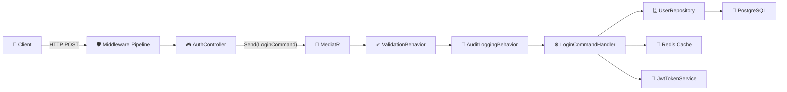
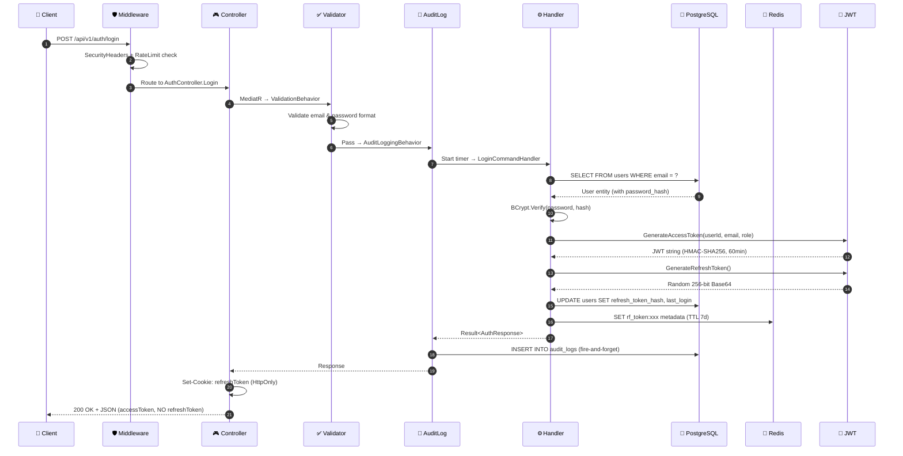

# 🔍 Deep Dive: Luồng API Đăng Nhập (Login Flow)

Tài liệu này mô tả chi tiết **từng bước** mà một request `POST /api/v1/auth/login` đi qua, từ lúc client gửi đến khi database trả kết quả.

## Kiến trúc tổng quan

Dự án sử dụng **Clean Architecture** 4 lớp + **CQRS** qua MediatR:



---

## Bước 1: Client gửi Request

Client gửi `POST /api/v1/auth/login` với body:

```json
{
  "email": "user@example.com",
  "password": "MyP@ssw0rd"
}
```

Body này được deserialize thành [LoginRequest](file:///e:/lexivocab-ex/LexiVocabAPI/src/LexiVocab.Application/DTOs/Auth/AuthDtos.cs#L10-L12):

```csharp
public record LoginRequest(string Email, string Password);
```

---

## Bước 2: Middleware Pipeline

Request đi qua chuỗi middleware theo thứ tự trong [Program.cs](file:///e:/lexivocab-ex/LexiVocabAPI/src/LexiVocab.API/Program.cs):

| # | Middleware | Chức năng |
|---|-----------|-----------|
| 1 | `SecurityHeadersMiddleware` | Thêm headers bảo mật (`X-Content-Type-Options`, `X-Frame-Options`...) |
| 2 | [GlobalExceptionMiddleware](file:///e:/lexivocab-ex/LexiVocabAPI/src/LexiVocab.API/Middlewares/GlobalExceptionMiddleware.cs#16-21) | Bắt **mọi exception** chưa xử lý, trả JSON chuẩn, không leak stack trace |
| 3 | `ForwardedHeaders` | Đọc `X-Forwarded-For` khi chạy sau reverse proxy (Docker) |
| 4 | `UseCors` | Cho phép cross-origin từ client (Chrome Extension, Next.js) |
| 5 | `UseRateLimiter` | **IP-based rate limiting** — Auth endpoint: 10 req/30s per IP |
| 6 | `UseAuthentication` | Validate JWT (nhưng Login endpoint **không yêu cầu** `[Authorize]`) |
| 7 | `UseAuthorization` | Kiểm tra role/policy (bỏ qua cho Login) |

> [!NOTE]
> Login endpoint không có `[Authorize]`, nên bước 6-7 chỉ chạy qua mà không block.

---

## Bước 3: Controller nhận Request

[AuthController.Login](file:///e:/lexivocab-ex/LexiVocabAPI/src/LexiVocab.API/Controllers/AuthController.cs#L37-L45):

```csharp
[HttpPost("login")]
public async Task<IActionResult> Login([FromBody] LoginRequest request, CancellationToken ct)
{
    var result = await _mediator.Send(
        new LoginCommand(request.Email, request.Password, ClientDevice, ClientIp), ct);
    return ToAuthResult(result);
}
```

**Điểm quan trọng:**
- Controller **không chứa logic nghiệp vụ** — chỉ tạo Command và gửi vào MediatR
- `ClientDevice` lấy từ `User-Agent` header, `ClientIp` từ `HttpContext.Connection`
- Cả 2 field [Password](file:///e:/lexivocab-ex/LexiVocabAPI/src/LexiVocab.Infrastructure/Authentication/BcryptPasswordHasher.cs#8-13), `DeviceInfo`, `IpAddress` được đánh `[JsonIgnore]` trong Command → **không bị serialize** khi audit log

---

## Bước 4: MediatR Pipeline — Validation

Trước khi đến Handler, request đi qua [ValidationBehavior](file:///e:/lexivocab-ex/LexiVocabAPI/src/LexiVocab.Application/Common/Behaviors/ValidationBehavior.cs):

```
Pipeline: Request → ValidationBehavior → AuditLoggingBehavior → Handler
```

[LoginCommandValidator](file:///e:/lexivocab-ex/LexiVocabAPI/src/LexiVocab.Application/Features/Auth/Validators/AuthValidators.cs#L28-L39) kiểm tra:

```csharp
RuleFor(x => x.Email)
    .NotEmpty().WithMessage("Email is required.")
    .EmailAddress();

RuleFor(x => x.Password)
    .NotEmpty().WithMessage("Password is required.");
```

Nếu **validation fail** → throw `ValidationException` → bị [GlobalExceptionMiddleware](file:///e:/lexivocab-ex/LexiVocabAPI/src/LexiVocab.API/Middlewares/GlobalExceptionMiddleware.cs#L38-L40) bắt → trả `400 Bad Request`:

```json
{
  "success": false,
  "error": "Email is required.; Password is required.",
  "statusCode": 400,
  "traceId": "...",
  "timestamp": "2026-03-04T01:29:00Z"
}
```

---

## Bước 5: MediatR Pipeline — Audit Logging

Nếu validation pass, request đi tiếp vào [AuditLoggingBehavior](file:///e:/lexivocab-ex/LexiVocabAPI/src/LexiVocab.Application/Common/Behaviors/AuditLoggingBehavior.cs):

- [LoginCommand](file:///e:/lexivocab-ex/LexiVocabAPI/src/LexiVocab.Application/Features/Auth/Commands/AuthCommands.cs#86-96) implement `IAuditedRequest` → behavior **kích hoạt**
- Bắt đầu **Stopwatch** đo thời gian
- Gọi Handler (bước tiếp theo)
- Sau khi Handler trả kết quả → ghi audit log vào DB (fire-and-forget, **không block** nếu lỗi)
- Ghi nhận: `AuditAction.Login`, email, thời gian, success/failure

> [!IMPORTANT]
> Các field nhạy cảm ([Password](file:///e:/lexivocab-ex/LexiVocabAPI/src/LexiVocab.Infrastructure/Authentication/BcryptPasswordHasher.cs#8-13), `DeviceInfo`) được đánh `[JsonIgnore]` nên **không bị serialize** vào audit log.

---

## Bước 6: LoginCommandHandler — Business Logic

[LoginCommandHandler.Handle](file:///e:/lexivocab-ex/LexiVocabAPI/src/LexiVocab.Application/Features/Auth/Commands/AuthCommands.cs#L112-L141) — đây là **trái tim** của luồng:

```csharp
public async Task<Result<AuthResponse>> Handle(LoginCommand request, CancellationToken ct)
{
    // 1️⃣ Tìm user bằng email
    var user = await _uow.Users.GetByEmailAsync(request.Email.ToLowerInvariant().Trim(), ct);
    if (user is null || user.PasswordHash is null)
        return Result<AuthResponse>.Unauthorized("Invalid email or password.");

    // 2️⃣ Verify password (BCrypt)
    if (!_hasher.Verify(request.Password, user.PasswordHash))
        return Result<AuthResponse>.Unauthorized("Invalid email or password.");

    // 3️⃣ Kiểm tra tài khoản active
    if (!user.IsActive)
        return Result<AuthResponse>.Forbidden("Account is deactivated.");

    // 4️⃣ Cập nhật LastLogin
    user.LastLogin = DateTime.UtcNow;

    // 5️⃣ Tạo Access Token (JWT) + Refresh Token (random 256-bit)
    var accessToken = _jwt.GenerateAccessToken(user.Id, user.Email, user.Role.ToString());
    var refreshToken = _jwt.GenerateRefreshToken();

    // 6️⃣ Lưu hash của Refresh Token vào DB + Redis
    user.RefreshTokenHash = _hasher.Hash(refreshToken);
    user.RefreshTokenExpiryTime = DateTime.UtcNow.AddDays(7);
    _uow.Users.Update(user);
    await _uow.SaveChangesAsync(ct);

    // 7️⃣ Cache metadata vào Redis (TTL 7 ngày)
    var metadata = JsonSerializer.Serialize(new RefreshTokenMetadata(...));
    await _cache.SetStringAsync($"rf_token:{refreshToken}", metadata, ...);

    // 8️⃣ Trả kết quả
    return Result<AuthResponse>.Success(new AuthResponse(...));
}
```

### Dependencies được inject qua DI:

| Service | Interface | Implementation | Vai trò |
|---------|-----------|---------------|---------|
| `_uow` | `IUnitOfWork` | `UnitOfWork` | Quản lý transaction, truy cập repositories |
| `_jwt` | `IJwtTokenService` | [JwtTokenService](file:///e:/lexivocab-ex/LexiVocabAPI/src/LexiVocab.Infrastructure/Authentication/JwtTokenService.cs#16-123) | Tạo/validate JWT tokens |
| `_hasher` | `IPasswordHasher` | [BcryptPasswordHasher](file:///e:/lexivocab-ex/LexiVocabAPI/src/LexiVocab.Infrastructure/Authentication/BcryptPasswordHasher.cs#8-13) | Hash/verify password bằng BCrypt |
| `_cache` | `IDistributedCache` | Redis | Lưu refresh token metadata |

---

## Bước 7: Database Query — Tìm User

[UserRepository.GetByEmailAsync](file:///e:/lexivocab-ex/LexiVocabAPI/src/LexiVocab.Infrastructure/Repositories/UserRepository.cs#L17-L18):

```csharp
public async Task<User?> GetByEmailAsync(string email, CancellationToken ct = default)
    => await _dbSet.FirstOrDefaultAsync(u => u.Email == email, ct);
```

**EF Core dịch thành SQL:**

```sql
SELECT u.id, u.email, u.password_hash, u.full_name, u.last_login,
       u.is_active, u.role, u.auth_provider, u.auth_provider_id,
       u.refresh_token_hash, u.refresh_token_expiry_time,
       u.plan_expiration_date, u.created_at, u.updated_at
FROM users u
WHERE u.email = @p0    -- 'user@example.com'
LIMIT 1;
```

Bảng `users` được map bởi [UserConfiguration](file:///e:/lexivocab-ex/LexiVocabAPI/src/LexiVocab.Infrastructure/Persistence/Configurations/UserConfiguration.cs):
- [Email](file:///e:/lexivocab-ex/LexiVocabAPI/src/LexiVocab.Infrastructure/Repositories/UserRepository.cs#17-19) → column `email` (VARCHAR 255, **UNIQUE INDEX**)
- [PasswordHash](file:///e:/lexivocab-ex/LexiVocabAPI/src/LexiVocab.Infrastructure/Authentication/BcryptPasswordHasher.cs#8-13) → column `password_hash` (VARCHAR 255)
- `Role` → column `role` (VARCHAR 20, stored as string: `"User"`, `"Premium"`, `"Admin"`)

---

## Bước 8: Password Verification

[BcryptPasswordHasher](file:///e:/lexivocab-ex/LexiVocabAPI/src/LexiVocab.Infrastructure/Authentication/BcryptPasswordHasher.cs):

```csharp
public bool Verify(string password, string hash)
    => BCrypt.Net.BCrypt.Verify(password, hash);
```

- So sánh `"MyP@ssw0rd"` với hash dạng `$2a$11$...` trong DB
- BCrypt tự extract salt từ hash → **timing-safe comparison**

---

## Bước 9: JWT Token Generation

[JwtTokenService.GenerateAccessToken](file:///e:/lexivocab-ex/LexiVocabAPI/src/LexiVocab.Infrastructure/Authentication/JwtTokenService.cs#L29-L51):

```csharp
var claims = new[] {
    new Claim(Sub, userId.ToString()),   // UUID
    new Claim(Email, email),
    new Claim(Role, role),               // "User" | "Premium" | "Admin"
    new Claim(Jti, Guid.NewGuid()),      // Unique token ID
    new Claim(Iat, timestamp)            // Issued at
};
// Sign với HMAC-SHA256, expire sau 60 phút (configurable)
```

**Refresh Token** = 32 bytes random → Base64 (256-bit entropy):

```csharp
public string GenerateRefreshToken()
{
    var randomBytes = new byte[32];
    using var rng = RandomNumberGenerator.Create();
    rng.GetBytes(randomBytes);
    return Convert.ToBase64String(randomBytes);
}
```

---

## Bước 10: Lưu vào DB + Redis

### Database (PostgreSQL):
```sql
UPDATE users
SET last_login = '2026-03-04T01:29:15Z',
    refresh_token_hash = '$2a$11$...',       -- BCrypt hash
    refresh_token_expiry_time = '2026-03-11T01:29:15Z',
    updated_at = '2026-03-04T01:29:15Z'      -- Auto-set bởi AppDbContext
WHERE id = @userId;
```

### Redis Cache:
```
SET rf_token:<base64_refresh_token> '{"UserId":"...","DeviceInfo":"...","IpAddress":"...","CreatedAt":"..."}'
EX 604800  -- TTL 7 ngày
```

> [!TIP]
> Refresh token được lưu **2 nơi**: hash trong DB (backup) + metadata trong Redis (fast lookup). Khi refresh, Redis được check trước.

---

## Bước 11: Response trả về Client

Controller gọi [ToAuthResult](file:///e:/lexivocab-ex/LexiVocabAPI/src/LexiVocab.API/Controllers/AuthController.cs#L113-L122):

```csharp
private IActionResult ToAuthResult(Result<AuthResponse> result)
{
    if (result.IsSuccess && result.Data is not null)
    {
        SetRefreshTokenCookie(result.Data.RefreshToken);  // HttpOnly cookie!
        return StatusCode(result.StatusCode, new { success = true, data = result.Data });
    }
    return StatusCode(result.StatusCode, new { success = false, error = result.Error });
}
```

### Refresh Token Cookie:
```
Set-Cookie: refreshToken=<base64_value>;
  HttpOnly;       ← JS không đọc được (chống XSS)
  Secure;         ← Chỉ gửi qua HTTPS
  SameSite=None;  ← Hỗ trợ Chrome Extension + cross-origin
  Expires=+7 days
```

### JSON Response (200 OK):
```json
{
  "success": true,
  "data": {
    "userId": "a1b2c3d4-...",
    "email": "user@example.com",
    "fullName": "Nguyen Van A",
    "role": "User",
    "accessToken": "eyJhbGciOiJIUzI1NiIs...",
    "expiresAt": "2026-03-04T02:29:15Z"
  }
}
```

> [!IMPORTANT]
> [RefreshToken](file:///e:/lexivocab-ex/LexiVocabAPI/src/LexiVocab.API/Controllers/AuthController.cs#57-70) **không có** trong JSON response (đánh `[JsonIgnore]`). Nó chỉ được truyền qua **HttpOnly cookie** — client không thể đọc bằng JavaScript.

---

## Tổng kết: Toàn bộ luồng



---

## Error Cases

| Tình huống | Nơi xử lý | HTTP Code | Error Message |
|-----------|-----------|-----------|---------------|
| Email trống | [ValidationBehavior](file:///e:/lexivocab-ex/LexiVocabAPI/src/LexiVocab.Application/Common/Behaviors/ValidationBehavior.cs#10-47) | 400 | "Email is required." |
| Email sai format | [ValidationBehavior](file:///e:/lexivocab-ex/LexiVocabAPI/src/LexiVocab.Application/Common/Behaviors/ValidationBehavior.cs#10-47) | 400 | "Invalid email format." |
| Email không tồn tại | [LoginCommandHandler](file:///e:/lexivocab-ex/LexiVocabAPI/src/LexiVocab.Application/Features/Auth/Commands/AuthCommands.cs#97-143) | 401 | "Invalid email or password." |
| Password sai | [LoginCommandHandler](file:///e:/lexivocab-ex/LexiVocabAPI/src/LexiVocab.Application/Features/Auth/Commands/AuthCommands.cs#97-143) | 401 | "Invalid email or password." |
| Account bị khóa | [LoginCommandHandler](file:///e:/lexivocab-ex/LexiVocabAPI/src/LexiVocab.Application/Features/Auth/Commands/AuthCommands.cs#97-143) | 403 | "Account is deactivated." |
| Rate limit vượt | `RateLimiter` middleware | 429 | (rejected) |
| Lỗi DB/Redis | [GlobalExceptionMiddleware](file:///e:/lexivocab-ex/LexiVocabAPI/src/LexiVocab.API/Middlewares/GlobalExceptionMiddleware.cs#16-21) | 500 | "An unexpected error occurred." |

> [!NOTE]
> Thông báo "Invalid email or password." được dùng cho cả **email không tồn tại** và **password sai** — để ngăn kẻ tấn công dò tìm email hợp lệ (user enumeration).
